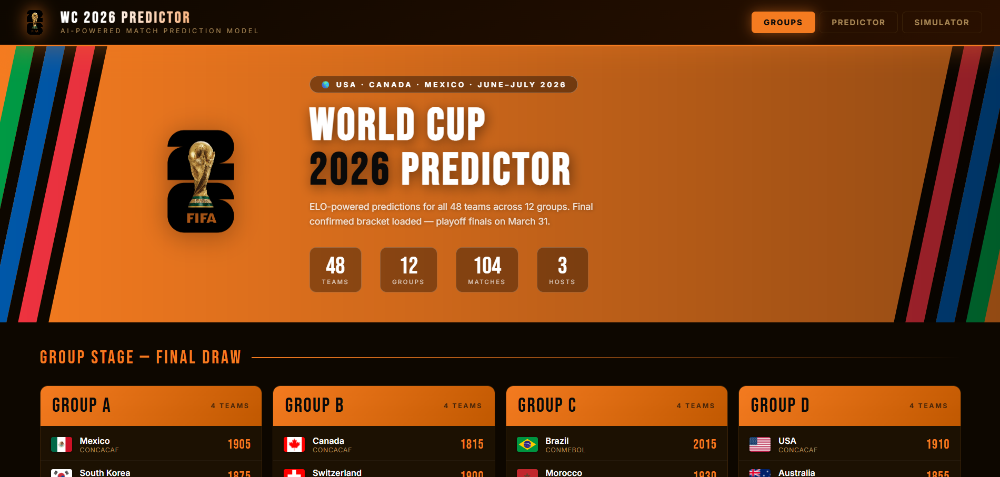

# ⚽ FIFA World Cup 2026 Predictor

> AI-powered ELO-based match prediction & full tournament simulator for all 48 teams across 12 groups.

**🔴 Live → [amrit-wc26predictor.vercel.app](https://amrit-wc26predictor.vercel.app)**



---

## Features

### 🗂 Groups
- All 12 confirmed groups (A–L) from the official FIFA draw
- Real country flags, ELO ratings & FIFA rankings per team
- Click any team for a stats modal — ELO bar, FIFA rank, confederation, tier, simulated recent form

### ⚡ Predictor
- Select any two of the 48 teams
- ELO-based Poisson distribution model:
  - Win / Draw / Loss probabilities with animated bars
  - 6 most likely scorelines with percentages
  - **xG** (expected goals) displayed per team
- ±25% random variance per prediction click

### 🏆 Simulator — Full Tournament
Complete round-by-round simulation:

| Stage | Teams | Matches |
|-------|-------|---------|
| Group Stage | 48 | 72 |
| Round of 32 | 32 | 16 |
| Round of 16 | 16 | 8 |
| Quarter-Finals | 8 | 4 |
| Semi-Finals | 4 | 2 |
| **Final** | **2** | **1** |

- Draws → **Extra Time** → **Penalty Shootout**
- 😱 **UPSET** badge when lower-ELO team wins (80+ ELO gap)
- Scores animate in staggered per round
- **Champion modal**: 3-2-1 countdown · flag burst · confetti cannon · full scoreline

---

## Model

```
Expected Goals = 1.5 × exp(ELO_diff / 500)

ELO diff  │  xG (favourite)  │  xG (underdog)
──────────┼──────────────────┼───────────────
    0     │      1.50        │     1.50
  100     │      1.83        │     1.22
  315     │      2.82        │     0.80   ← France vs Panama
  400     │      3.35        │     0.67   ← Argentina vs Jordan
```

Scorelines from **Poisson(λ)**. Win/draw/loss odds use the **ELO formula** with Gaussian draw adjustment.

---

## Stack

- **Pure HTML / CSS / JavaScript** — no dependencies, no build step
- **flagcdn.com** — real country flags
- **Vercel** — static deployment
- **Python 3** HTTP server for local preview

---

## Local Preview

```bash
python -m http.server 5500 --directory ui/
# Open http://localhost:5500
```

---

## Data

Group draw: [`data/raw/worldcup2026_groups.yaml`](data/raw/worldcup2026_groups.yaml)
Source: Official FIFA Draw (confirmed March 2026).

---

*Built with Claude Code · Deployed on Vercel*
